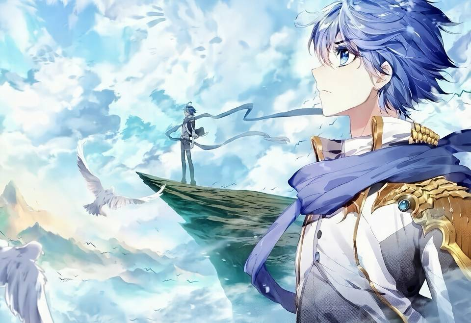

# poe-api
由于Poe不开放对外api，本项目使用selenium工具模拟制作了一个api接口。   
Since Poe is not open to the outside world, this project uses the selenium tool to simulate and make an api interface.

## 使用示例
**1.文本单轮对话**
```
from poe import Poe

poe = Poe(model='https://poe.com/GPT-4.1-nano', cookies_path='poe_cookies.pkl') # cookies_path可以任意命名，但后缀必须为.pkl

text = '1+1=?'
output = poe.chat(text, clean=True) # 清除上下文
print(output)
```
**输出**
```
1 + 1 = 2
```

**2.文本多轮对话**
```
from poe import Poe

poe = Poe(model='https://poe.com/GPT-4.1-nano', cookies_path='poe_cookies.pkl') # cookies_path可以任意命名，但后缀必须为.pkl

text1 = '1+1=？'
output1 = poe.chat(text1, clean=False) # 保留上下文
print(output1)
```
**输出1**
```
1 + 1 = 2
```

```
text2 = '真的吗？'
output2 = poe.chat(text2, clean=False) # 保留上下文
print(output2)
```
**输出2**
```
当然是真的！在基本的算术中，1 加 1 等于 2。如果你有其他数学问题或者想了解更多内容，随时告诉我！
```


**3.文本+图片 单轮对话**
```
from poe import Poe

poe = Poe(model='https://poe.com/GPT-4.1-nano', cookies_path='poe_cookies.pkl')

text = '请描述这张图片。'
image = "AB4B1B4CB1634F04865F0A41F1D4ACBC.jpg"
output = poe.chat(text, image=image, clean=True)
print(output)
```


**输出**
```
这是一幅充满幻想色彩的动漫风格插画。画面中，主要人物是一位蓝发的少年，他身穿具有金色装饰的白色军装，搭配深蓝色的披风，望向远方，神情坚毅而深沉。
画面背景是一片广阔的天空，云层飘渺，色调明亮，带有一些淡淡的蓝色和白色，营造出一种空灵、梦幻的氛围。在远处的天空中，有另一位少年站在一艘木制的船头上，似乎在远望或思考，展现出一种孤寂或追寻的感觉。
画面左侧还可以看到几只白色的鸟在飞翔，为整个场景增添了动态和生命力。整体色调偏向冷色系，强调出一种宁静而又略带忧郁的情感。画面具有浓厚的幻想和冒险气息，充满了对未来的向往和探索的意味。
```
